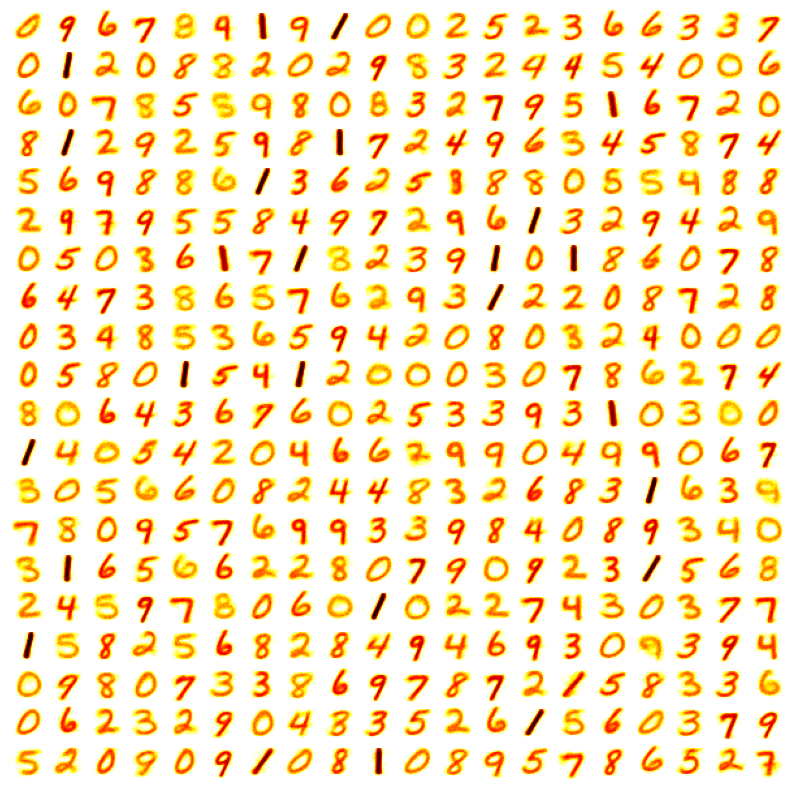
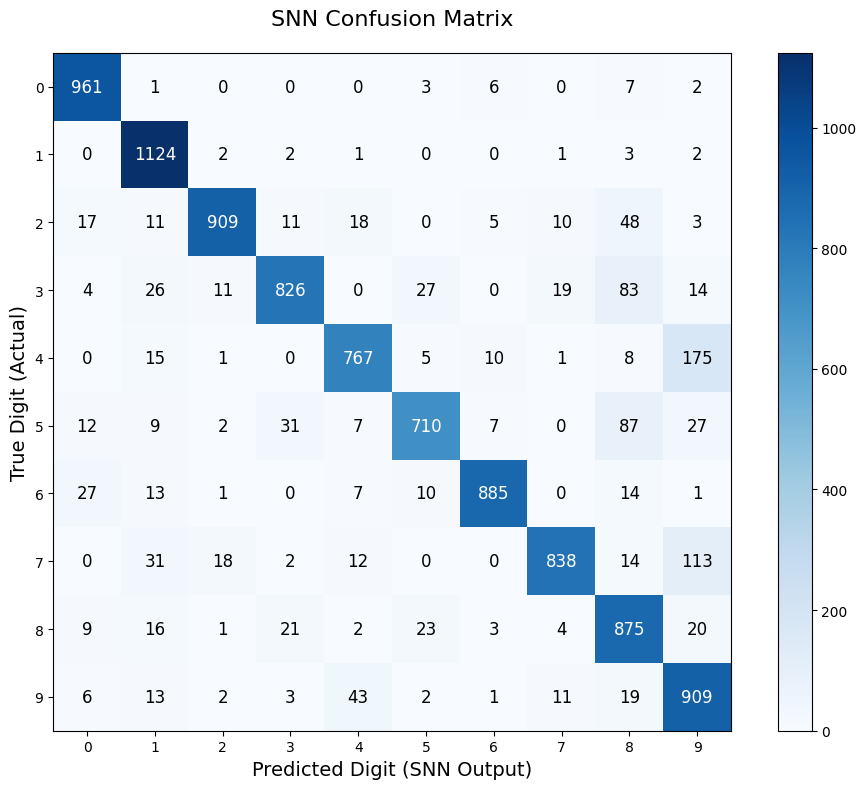

# Unsupervised Spiking Neural Network for MNIST Classification
This project implements the Spiking Neural Network (SNN) described in the paper *"Unsupervised learning of digit recognition using spike-timing-dependent plasticity"* by Diehl and Cook (2015) to perform unsupervised image classification on the MNIST handwritten digit dataset. The network utilizes 400 excitatory neurons and achieved a final test accuracy of **88.04%**.

## Network Architecture
The network consists of three layers:

1. **Input Layer:** Represents the $28 \times 28$ MNIST pixel grid. Pixel intensities are converted into firing rates (Poisson spike trains) with a maximum rate of roughly 63 Hz.
2. **Excitatory Layer (400 neurons):** Each neuron is fully connected to the input layer via STDP synapses. 
3. **Inhibitory Layer (400 neurons):** Each excitatory neuron has a 1-to-1 mapping to a corresponding inhibitory neuron. Once triggered, the inhibitory neuron suppresses all *other* excitatory neurons. (Winner-Take-All)

## Training and Evaluation
The learning process is split into three distinct phases across two Jupyter Notebooks:

###  Phase 1: Unsupervised Learning (in `train.ipynb`)
* STDP and homeostasis are completely active.
* We use this STDP update rule: $$\Delta w = \eta (x_{pre} - x_{tar})(w_{max} - w)^\mu$$
* Feeds the full 60,000 MNIST training set through the network.
* Saves the trained `weights.npy` and `theta.npy` arrays.

**Learned Receptive Fields :** The grid below visualizes the synaptic weights connecting the input layer to the 400 excitatory neurons after training on 60,000 images.

### Phase 2 : Label Assignment (in `Testing.ipynb`)
*  Loads a "frozen" version of the network where STDP and $\theta$ updates are disabled.
*  Feeds a subset of the training set (10,000 images) through the frozen network.
*  tallying the spikes to determine which digit (0-9) each of the 400 neurons has specialized in.
*  Saves the assigned labels as `neuron_labels.npy`
  
### Phase 3 : Final Evaluation (in `Testing.ipynb`)
* Runs the 10,000 unseen MNIST test images through the frozen network.
* Evaluates the predictions based on the assigned labels and generates a final accuracy score and
* visual Confusion Matrix.

### The frozen network achieves an overall accuracy of **88.04%**.

## Overview of repo:
1. `constants.py` : stores all the configuration values
2. `equations.py` : contains differential equations for the neurons and the expressions for STDP learning.
3. `network.py` : contains the `build_network_train()` and `build_network_test()` functions.
4. `random_weights.py` : script that generates the random synaptic weights before training begins.
5. `train.ipynb` : used for unsupervised learning
6. `Testing.ipynb` : used for label assignment and final evaluation
7. `reference/` : directory containing the original code
8. `trained_model/` : directory containing the trained weights and labels